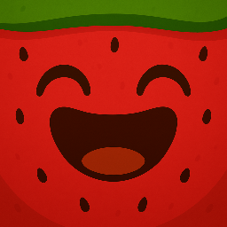

# Suika 2048 – Portfolio Prototype

A modern, visually enhanced 2048 game inspired by Suika Game, built as a portfolio prototype project. This version features multiple themes (including fruit and number tiles), responsive design, dark mode, and smooth user experience.



---

## Live Demo

The project is deployed and publicly available via GitHub Pages:

👉 [View the Live Project on GitHub Pages](https://enis-uys.github.io/suika-2048-hosted/)  

---

## Features

- **Classic 2048 Gameplay:** Slide and merge tiles to reach 2048.
- **Multiple Themes:** Choose between fruit or number tiles. Fruit images were generated using generative AI (GenAI).
- **Dark & Light Mode:** Toggle between dark and light themes for comfortable play in any environment.
- **Responsive Design:** Works on desktop and mobile.
- **Animated UI:** Smooth transitions, modern look, and intuitive controls.

---

## Getting Started

1. **Clone the repository**
   ```bash
   git clone <your-repo-url>
   cd 2048
   ```
2. **Open `index.html` in your browser**
   No build step is required – everything runs client-side.

---

## About the Images

- **Fruit and Number Tiles:**
  - The fruit images used in the game were generated with generative AI (GenAI) tools.
  - These images are for demonstration and prototyping purposes only and are not intended for commercial use.

---

## Disclaimer

This project is a **prototype** and serves as a demonstration for portfolio purposes only. The code and assets are not production-ready and should not be used as-is for commercial projects.

---

## Author

- [Enis Uysal]
- [enis.uys@outlook.com]

---

## License

This project is open source and available under the MIT License.
